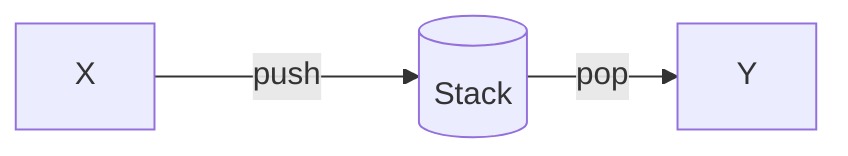
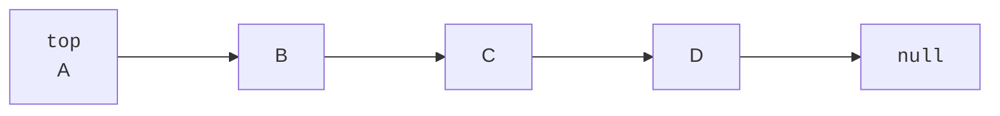
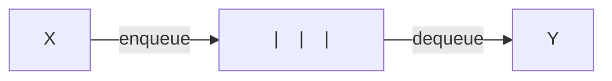
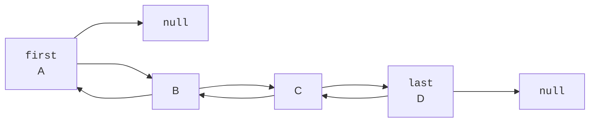
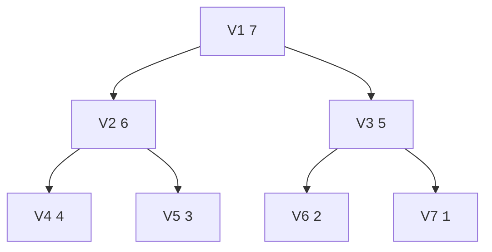
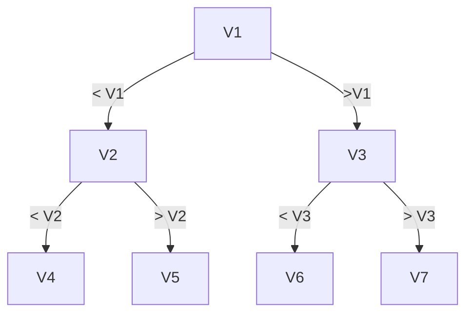

[TOC]

# Abstract Data Types (ADTs)

## Stack

### Methods

- `push(x, S)`: Puts `x`onto the stack `S`
- `pop(S)`: Remove (and returns) the top element of the stack `S`
- `top(S)`: Returns the top element of the stack `S`

### Visualization



### Structure

**Linked List:**



### Runtime

- `push(x, S)`$\in \mathcal{O}(1)$
- `pop(S)`$\in \mathcal{O}(1)$
- `top(S)`$\in \mathcal{O}(1)$

## Queue

### Methods

- `enqueue(x, S)`: Add `x`to the queue `S`
- `dequeue(S)`: Remove the first element of the queue `S`

### Visualization



### Structure

**Doubly Linked List:**



### Runtime

- `enqueue(x, S)`: $\in \mathcal{O}(1)$
- `dequeue(S)`: $\in \mathcal{O}(1)$

## Priority Queue

###  Methods

- `insert(x, p, P)`: Insert `x`with priority `p`into the queue `P`
- `extractMax(P)`: Extracts the elements with maximal priority from the queue `P`

### Structure

**Max-Heap:**



### Runtime

- `insert(x, p, P)`: $\in \mathcal{O}(log(n))$
- `extractMax(P)`: $\in \mathcal{O}(log(n))$

## Dictionary 

###  Methods

- `search(x, W)`: Finds `w`in dictionary `W`
- `insert(x, W)`: Insert `x`in dictionary `W`
- `remove(x, W)`: Remove`x` from the dictionary `W`

### Structure

**Search Tree:**



## Union-Find

Data structure used to compare ZHKs of a given graph.

### Methods

- `make(V)`: Create a data structure for $F = \emptyset$
- `same(u, v)`: Test whether $u, v$ are in the same ZHK of $F$
- `union(u, v)`: Merge ZHKs where $u$ and $v$ are

### Structure

List `rep[]`which stores the identifiers of all the vertices. `rep[u]`= `rep[v]` if and only if THK(v) = ZHK(u).

### Implementation

```pseudocode
make(v):
	for (v in V):
		rep[v] = v
		
same(u, v):
	return rep[u] == rep[v]

// members[rep[u]] is a list containing all the nodes in ZHK(u)
union(u, v):
	for (x in memebers[rep[u]]):
		rep[x] = rep[v]
		members[rep[v]].add(x)
```

### Runtime

- `make(V)` $\in \mathcal{O}(|V|)$
- `same(u, v)` $\in \mathcal{O}(1)$
- `union(u, v)` $\in \mathcal{O}(|ZHK(u)|)$

## Weighted Quick-Union

```java
class UnionFind {
    int[] id;
    int[] size;
        
    public UnionFind(int N) {
        create(N);
    }
    
    void create(int N) {
        id = new int[N];
        for (int i = 0; i < N; ++i) {
            id[i] = i;
            size[i] = 1;
        }
    }
    
    private int root(int i) {
        while (i != id[i]) {
            id[i] = id[id[i]];
            i = id[i];
        }
        return i;
    }
    
    public int find(int x, int y) {
        return root(x) == root(y);
    }
    
    public void union(int x, int y) {
        if (size[x] < size[y]) { id[x] = y; size[y] += size[x]; }
        else { id[y] = x; size[x] += size[y]; }
    }
}
```


## AVL Trees

### Description

Most of the BST operations (e.g., `search`, `max`, `min`, `insert`, `delete`,...) take $\mathcal{O}(h)$ time where $h$ is the height of the BST. The cost of these operations may become $\mathcal{O}(n)$ for a skewed Binary tree.
If we make sure that height of the tree remains $\mathcal{O}(log(n))$ after every insertion and deletion, then we can guarantee an upper bound of $\mathcal{O}(log(n))$ for all these operations. The height of an AVL tree is always $\mathcal{O}(log(n))$ where $n$ is the number of nodes in the tree

We define the balance of a vertex $v$, $bal(v) = h(T_r(v)) - h(T_l(v))$. For a Search Tree to fulfill the AVL-condition, we need $\forall v  \ bal(v) \in \{-1, 0, 1\}$

<figure> <figcaption>An AVL Tree with every balance value written below the corresponding node</figcaption></figure>

We distinguish three states of a node $p$ before inserting a node:

- $bal(p) = -1$: not possible
- $bal(p) = 0$
- $bal(p) = 1$

### Insertion

#### Left and right rotation

```
T1, T2 and T3 are subtrees of the tree rooted with y (on the left side) or x (on the right side)  

                                     y                               x
                                    / \     Right Rotation          /  \
                                   x   T3   - - - - - - - >        T1   y 
                                  / \       < - - - - - - -            / \
                                 T1  T2     Left Rotation            T2  T3
                                 
Keys in both of the above trees follow the following order: 
                               keys(T1) < key(x) < keys(T2) < key(y) < keys(T3)
So BST property is not violated anywhere.
```

#### Insertion and rotations

**Steps to follow for insertion**
Let the newly inserted node be w

* Perform standard BST insert for $w$.

* Starting from $w$, travel up and find the first unbalanced node. Let $z$ be the first unbalanced node, $y$ be the child of $z$ that comes on the path from $w$ to $z$ and $x$ be the grandchild of $z$ that comes on the path from $w$ to $z$.

* Re-balance the tree by performing appropriate rotations on the subtree rooted with $z$. There can be 4 possible cases that needs to be handled as $x$, $y$ and $z$ can be arranged in 4 ways. Following are the possible 4 arrangements:

  * $y$ is left child of $z$ and x is left child of $y$ (**Left Left Case**)
  * $y$ is left child of $z$ and $x$ is right child of $y$ (**Left Right Case**)
  * $y$ is right child of $z$ and $x$ is right child of $y$ (**Right Right Case**)
  * $y$ is right child of $z$ and $x$ is left child of $y$ (**Right Left Case**)

**a) Left Left Case**

```
T1, T2, T3 and T4 are subtrees.
         z                                      y 
        / \                                   /   \
       y   T4      Right Rotate (z)          x      z
      / \          - - - - - - - - ->      /  \    /  \ 
     x   T3                               T1  T2  T3  T4
    / \
  T1   T2
```

**b) Left Right Case**

```
     z                               z                           x
    / \                            /   \                        /  \ 
   y   T4  Left Rotate (y)        x    T4  Right Rotate(z)    y      z
  / \      - - - - - - - - ->    /  \      - - - - - - - ->  / \    / \
T1   x                          y    T3                    T1  T2 T3  T4
    / \                        / \
  T2   T3                    T1   T2
```

**c) Right Right Case**

```
  z                                y
 /  \                            /   \ 
T1   y     Left Rotate(z)       z      x
    /  \   - - - - - - - ->    / \    / \
   T2   x                     T1  T2 T3  T4
       / \
     T3  T4
```

**d) Right Left Case**

```
   z                            z                            x
  / \                          / \                          /  \ 
T1   y   Right Rotate (y)    T1   x      Left Rotate(z)   z      y
    / \  - - - - - - - - ->     /  \   - - - - - - - ->  / \    / \
   x   T4                      T2   y                  T1  T2  T3  T4
  / \                              /  \
T2   T3                           T3   T4
```
