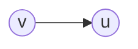
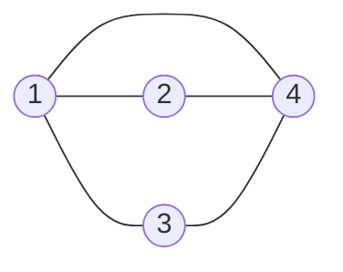
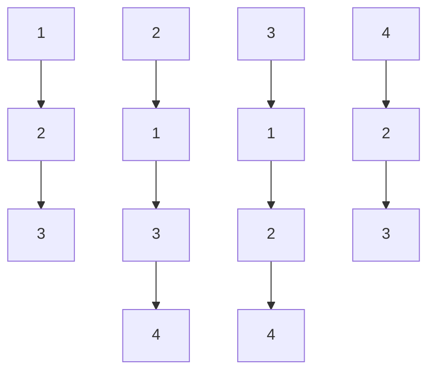

# Graph theory

## Glossary

- **Graph G  (V, E)**:
  - **V**: vertices set
  - **E**: edges set
- **Degree**: number of vertices
- **Walk**: series of connected vertices
- **Path**: walk without repeated vertices
- **Closed walk**: walk where v~0~ = v~n~
- **Cycle**: closed walk without repeating vertices
- **Euler path**: visit each edge once
- **Hamilton path**: visit each vertex once
- **Directed graph**: edges are ordered pairs
- **Ancestor**: v, **Successor**: u  in 

- **deg~in~(v)**: number of incoming edges into v

- **deg~out~(v)**: number of outgoing edges into v

  

## Graph Representation

### Adjacency matrix

matrix where $A_{uv} = \begin{cases} 1 & \text{if} (u,v) \in E \\ 0 & \text{otherwise} \end{cases}$

**Graph:**

**Matrix:**
$$
\begin{pmatrix}
0 & 1 & 1 & 1\\
1 & 0 & 0 & 1\\
1 & 0 & 0 & 1\\
1 & 1 & 1 & 0\\
\end{pmatrix}
$$

  ### Adjacency list

Array of linked lists, where Adj[u] contains a list containing all the neighbors of u.

**Graph:** Same as above

**List:**

