[TOC]

# Abstract Data Types (ADTs)

## Stack

### Methods

- `push(x, S)`: Puts `x`onto the stack `S`
- `pop(S)`: Remove (and returns) the top element of the stack `S`
- `top(S)`: Returns the top element of the stack `S`

### Visualization

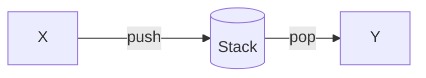

### Structure

**Linked List:**

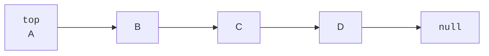

### Runtime

- `push(x, S)`$\in \mathcal{O}(1)$
- `pop(S)`$\in \mathcal{O}(1)$
- `top(S)`$\in \mathcal{O}(1)$

## Queue

### Methods

- `enqueue(x, S)`: Add `x`to the queue `S`
- `dequeue(S)`: Remove the first element of the queue `S`

### Visualization


### Structure

**Doubly Linked List:**

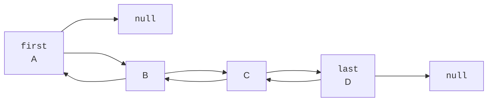

### Runtime

- `enqueue(x, S)`: $\in \mathcal{O}(1)$
- `dequeue(S)`: $\in \mathcal{O}(1)$

## Priority Queue

###  Methods

# Graph theory

## Glossary

- **Graph G  (V, E)**:
  - **V**: vertices set
  - **E**: edges set
- **Degree**: number of vertices
- **Walk**: series of connected vertices
- **Path**: walk without repeated vertices
- **Closed walk**: walk where v~0~ = v~n~
- **Cycle**: closed walk without repeating vertices
- **Euler path**: visit each edge exactly once
- **Hamilton path**: visit each vertex exactly once
- **Directed graph**: edges are ordered pairs
- **Ancestor**: v, **Successor**: u  in 

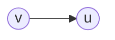

- **deg~in~(v)**: number of incoming edges into v

- **deg~out~(v)**: number of outgoing edges into v

  

## Graph Representation

### Adjacency matrix:

matrix where $A_{uv} = \begin{cases} 1 & \text{if} (u,v) \in E \\ 0 & \text{otherwise} \end{cases}$
**Graph:**

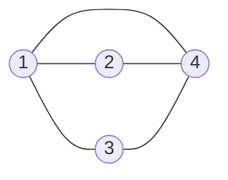

**Matrix:**
$$
\begin{pmatrix}
0 & 1 & 1 & 1\\
1 & 0 & 0 & 1\\
1 & 0 & 0 & 1\\
1 & 1 & 1 & 0\\
\end{pmatrix}
$$

  ### Adjacency list

Array of linked lists, where Adj[u] contains a list containing all the neighbors of u.
**Graph:** Same as above
**List:**

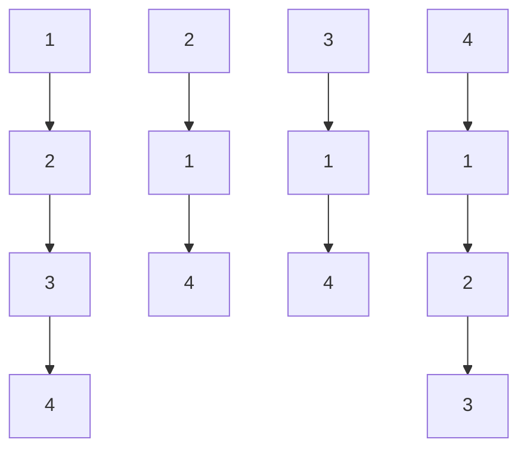

### Runtimes

|                                              | Matrix                   | List                                               |
| -------------------------------------------- | ------------------------ | -------------------------------------------------- |
| Find all neighbors of $v$                    | $\mathcal{O}(n)$         | $\mathcal{O}(deg_{out}(v))$                        |
| Find $v \in V$ without neighbors             | $\mathcal{O}(n^2)$       | $\mathcal{O}(n)$                                   |
| Check if $(v,u) \in E$                       | $\mathcal{O}(1)$         | $\mathcal{O}(1 + min(deg_{out}(v), deg_{out}(u)))$ |
| Insert edge                                  | $\mathcal{O}(1)$         | $\mathcal{O}(1)$                                   |
| Remove edge $v$                              | $\mathcal{O}(1)$         | $\mathcal{O}(deg_{out}(v))$                        |
| Check whether an Eulerian path exists or not | $\mathcal{O}(|V| * |E|)$ | $\mathcal{O}(|V| + |E|)$                           |

 ## Algorithms

### Depth-First Search (DFS)

Used mainly to check whether a Graph can be topological sorted or not ($\Leftrightarrow$ has a cycle). A **topological sorting** of a graph it's a sequence of all its nodes with the property that a node $u$ comes after a node $v$ **if and only if** either a walk from $v$ to $u$ exists or $u$ cannot be reached starting from $v$.

#### Pseudocode

```pseudocode
DFS(G):
	t = 1
	for (v in V not marked):
		DFS-Visit(v)
```

```pseudocode
DFS-Visit(v):
	pre[v] = t++
	marked[v] = true
	for ((u, v) in E not marked)
		DFS_Visit(u)
	post[u] = t++
```

#### Runtime

| Operations | $T(n) \in \Theta(|E| + |V|)$ |
| ---------- | ---------------------------- |
| **Memory** | $T(n) \in \Theta(|V|)$       |

#### Edge classification (post and pre numbers)

**Example:** `DFS(A)` got called

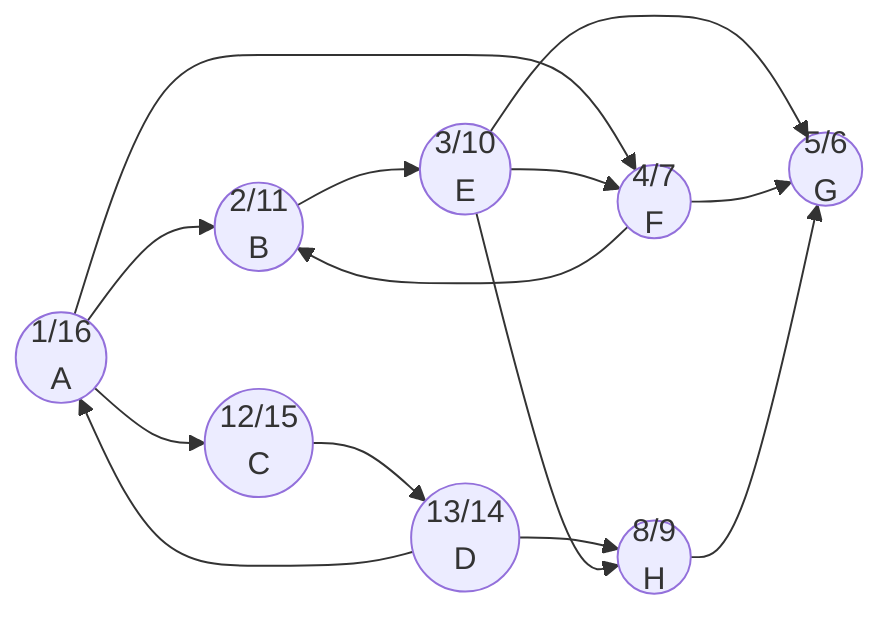

This graph generate the following tree (rotated of 90 degree to save space):

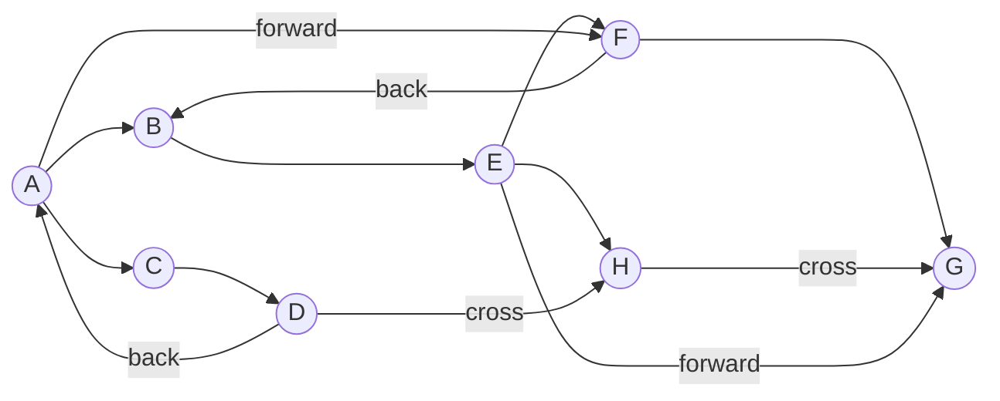

| Pre and post number                                          | Name of the edge $(v, u) \in E$ |
| ------------------------------------------------------------ | ------------------------------- |
| $pre(u) < pre(v)$ and $post(u) < post(v)$                    | Not possible                    |
| $pre(u) < pre(v)$ and $post(u) > post(v)$                    | **Tree edge**                   |
| $pre(u) < pre(w)$ and $post(u) < post(v)$ but $(u,v) \notin E$ | **Forward edge**                |
| $pre(u) > pre(v)$ and $post(u) > post(v)$                    | **Back edge**                   |
| $pre(u) > pre(v)$ and $post(u) > post(v)$                    | **Cross edge**                  |
| $pre(u) < pre(v)$ and $post(u) < post(v)$                    | Not possible                    |

**Remark:** $\nexists$ back edge $\Leftrightarrow$ $\nexists$ closed walk (cycle)

### Breadth-First Search (BFS)

Instead of searching through the depth of a graph, one can also go first through all the successor of the root with the BFS algorithm.

#### Pseudocode

```pseudocode
BFS(G):
	for (v in V not marked):
		BFS-Visit(v)
```


```pseudocode
BFS-VIsit(v):
	Q = new Queue()
	active[v] = true //used to check whether a vertex is in the queue or not
	enqueue(v, Q)
	while (!isEmpty(Q)):
		w = dequeue(Q)
		visited[W] = true
		for ((w, x) in E):
			if(!active[x] && !visited[x]):
				active[x] = true
				enqueue(x, Q)
```

#### Runtime

| Operations | $T(n) \in \Theta(|E| + |V|)$ |
| ---------- | ---------------------------- |
| **Memory** | $T(n) \in \Theta(|V|)$       |

### Find shortest path in DAG (Directed Acyclic Graph) 

We can compute a recurrence following the topological sorting of the graph.

#### Pseudocode

```pseudocode
ShortestPath(V):
	d[s] = 0, d[v] = inf
	for (v in V \ {s}, following topological sorting):
		for (u, v, s.t. (u, v) in E):
			d[v] = min(d[u] + c(u,v)) 
```

#### Runtime 

$T(n) \in \mathcal{O}(|E| * |V|)$ if adjacency list is given

### Djikstra 

Used to find the shortest (cheapest) path between two nodes in a graph. 
**Remark:** The graph must **not** have negative weights

#### Pseudocode

```pseudocode
DijkstraG, s):
	for (v in V):
		distance[v] = infinity
		parent[v] = null
	distance[s] = 0
	Q = new Queue()
	insert(Q, s, 0) // insert s into the queue Q, with priority 0 (min)
	while(!Q.isEmpty()):
		v* = Q.extractMin() // extract from Q the node with minimum distance
		for ((v*, v) in E):
			if (parent[v] == null):
				distance[v] = distance[v*] + w(v*, v)
				parent[v] = v*
			else if (distance[v*] + w(v*, v) < distance[v]):
				distance[v] = distance[v*] + w(v*, v)
				parent[v] = v*
				decreaseKey(Q, v, distance[v])
```

#### Runtime

If implemented with a Heap: $T(n) \in \mathcal{O}((|E| + |V|)*log(|V|))$
If implemented with a **Fibonacci-Heap**: $T(n) \in \mathcal{O}((|E| + |V|*log(|V|))$)

### Bellman-Ford

Used for graph with general weight (**positive and negative!**)

#### Pseudocode

```pseudocode
BellmanFord(G, s):
	for (v in V):
		distance[v] = infinity
		parent[v] = null
	distance[s] = 0
	for (i = 1, 2, ..., |V| - 1):
		for ((u, v) in E):
			if(distance[v] > distance[u] + w(u, v)):
				distance[v] = distance[u] + w(u, v)
				parent[v] = u
	for ((u, v) in E):
		if (distance[u] + w(u, v) < distance [v]):
			return "negative cyrcle!"
```

#### Runtime

$T(n) \in \mathcal{O}(|E| * |V|)$

### Boruvka

Used to find a MST in a given graph G

#### Minimum Spanning Trees (MSTs)

A minimum spanning tree is a subgraph $H = (V, E^*)$ of a graph $G = (V, E)$ with $E^* \subseteq E$, such that every vertex $v \in V$ is connected and that **the sum of all edges' weight is minimal**.

#### Pseudocode

```pseudocode
Boruvka(G):
	F = new Set() // Initialize a new forest with every vertex being a tree and 0 edges
	while (F not SpanningTree): // check that ZHKs of F > 1
		ZHKs of F = (S1, ..., Sk)
		minEdges of S1, ..., Sk = (e1, ..., ek)
		F = F U (e1, ..., ek)
	return F
```

#### Runtime 

$T(n) \in \mathcal{O}((|E| + |V|) * log(|V|))$

#### Example

First choose the minimal edge for every vertex and add them to the new graph. Then repeat for every ZHK (vertices connected with edges) until you have a MST (until there is only 1 ZHK).

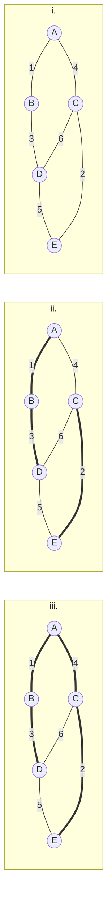

### Prim

Alternative to Kruskal, it needs a starting vertex as input.

#### Pseudocode

```pseudocode
Prim(G, s):
	MST = new Set()
	H = new Heap(V, infinity)
	for (v in V):
		d[v] = infinity
	d[s] = 0
	decreaseKey(H, s, 0)
	while (!H.isEmpty()):
		v = extractMin(H)
		MST.add(v)
		for ((v, u) in E && v != s)
			d[v] = min(d[v], w(v, u))
			decreaseKey(H, v, d[v])
```

#### Runtime

$T(n) \in \mathcal{O}((|E| + |V|) * log(|V|))$

#### Example

Add the minimal edge adjacent to s. Then take the newly created ZHK and add to it its minimal outgoing edge. Proceed like that until you have a spanning tree (all the vertices are connected).

```mermaid
graph LR
	subgraph v.
	AAAAA((A)) === |1| BBBBB((B))
	AAAAA === |4| CCCCC((C))
	BBBBB === |3| DDDDD((D))
	CCCCC --- |6| DDDDD
	CCCCC === |2| EEEEE((E))
	DDDDD --- |5| EEEEE((E))
	end
	subgraph iv.
	AAAA((A)) === |1| BBBB((B))
	AAAA === |4| CCCC((C))
	BBBB === |3| DDDD((D))
	CCCC --- |6| DDDD
	CCCC --- |2| EEEE((E))
	DDDD --- |5| EEEE((E))
	end
	subgraph iii.
	AAA((A)) === |1| BBB((B))
	AAA --- |4| CCC((C))
	BBB === |3| DDD((D))
	CCC --- |6| DDD
	CCC --- |2| EEE((E))
	DDD --- |5| EEE((E))
	end
	subgraph ii.
	AA((A)) === |1| BB((B))
	AA --- |4| CC((C))
	BB --- |3| DD((D))
	CC --- |6| DD
	CC --- |2| EE((E))
	DD --- |5| EE((E))
	end
	subgraph i.
	A((A)) --- |1| B((B))
	A --- |4| C((C))
	B --- |3| D((D))
	C --- |6| D
	C --- |2| E((E))
	D --- |5| E((E))
	end
```

### Kruskal

Another algorithm to find a MST in a given graph. It sorts edges by weight and adds them one by one, **unless adding an edge would form a cycle**.

#### Pseudocode

```pseudocode
Kruskal(G):
	MST = new Set()
	E.sort() // sort all edges by weight
	for ((u, v) in E):
		if (u and v in 2 different ZHKs of MST):
			MST.add(e)
```

#### Runtime

If implemented normally: $T(n) \in \mathcal{O}(|E| * |V| + |E| * log(|E|))$ (second part to sort)
If implemented with an improved union-find DS: $T(n) \in \mathcal{O}(|V| * log(|V|) + |E| * log(|E|))$ (second part to sort)

#### Example

Add edges one by one following weight-order. If adding an edge would form a cycle, skip it.

```mermaid
graph LR
	subgraph v.
	AAAAA((A)) === |1| BBBBB((B))
	AAAAA === |4| CCCCC((C))
	BBBBB === |3| DDDDD((D))
	CCCCC --- |6| DDDDD
	CCCCC === |2| EEEEE((E))
	DDDDD --- |5| EEEEE((E))
	end
	subgraph iv.
	AAAA((A)) === |1| BBBB((B))
	AAAA --- |4| CCCC((C))
	BBBB === |3| DDDD((D))
	CCCC --- |6| DDDD
	CCCC === |2| EEEE((E))
	DDDD --- |5| EEEE((E))
	end
	subgraph iii.
	AAA((A)) === |1| BBB((B))
	AAA --- |4| CCC((C))
	BBB --- |3| DDD((D))
	CCC --- |6| DDD
	CCC === |2| EEE((E))
	DDD --- |5| EEE((E))
	end
	subgraph ii.
	AA((A)) === |1| BB((B))
	AA --- |4| CC((C))
	BB --- |3| DD((D))
	CC --- |6| DD
	CC --- |2| EE((E))
	DD --- |5| EE((E))
	end
	subgraph i.
	A((A)) --- |1| B((B))
	A --- |4| C((C))
	B --- |3| D((D))
	C --- |6| D
	C --- |2| E((E))
	D --- |5| E((E))
	end
```

### Floyd-Warshall

Used to solve the **all-pair shortest path** problem, i.e., to find the shortest distance between **any** two vertices of a given graph $G$.
It makes use of a 3-Dimensional DP table.

#### Pseudocode

`d[i][u][v]` represents the shortest path from $u$ to $v$ passing through $\leq i$ vertices.

```pseudocode
FloydWarshall(G):
	for (v in V):
		d[0][v][v] = 0 // layer 0, row v, column v
	for ((v, u) in E):
		d[0][v][u] = w(v, u)
	else: // if u, v isn't in E
		d[0][v][u] = infinity
	for (i = 1, ..., |V|):
		for (u = 1, ..., |V|):
			for (v = 1, ..., |V|):
				d[i][u][v] = min(d[i-1][u][v], d[i-1][u][i] + d[i-1][i][v])
	return d
```

**Remarks:** 

- This algorithm can be implemented **inplace**, it just suffice to leave the indices away.

- The algorithm does **not** work if negative cycles are present.

#### Runtime

$T(n) \in \mathcal{O}(|V|^3)$

### Johnson

Used to solve the all-pair shortest path problem. First one has to make every weight positive, by adding an "external" vertex, and then proceed by using Dijkstra $|V|$ times.

#### Example

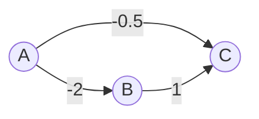

- First, add the new vertex, and connect it to every other vertex with weight $0$.
  $h(n)$ is the "height" of the node $n$, equals to **the shortest path from $N$ to $n$** , found by applying $n$ times Dijkstra.

  ```mermaid
  graph LR
  	A(("A <br> h(a) = 0")) --> |-2| B(("B <br> h(b) = -2"))
  	A --> |-0.5| C(("C <br> h(c) = -1"))
  	B --> |1| C
  	N((N)) ----> |0| A & B & C
  ```

- We now can modify each weight $w(u, v)$ of each edge into a new weight $w^*(u, v) = w(u, v) + (h(u) - h())$

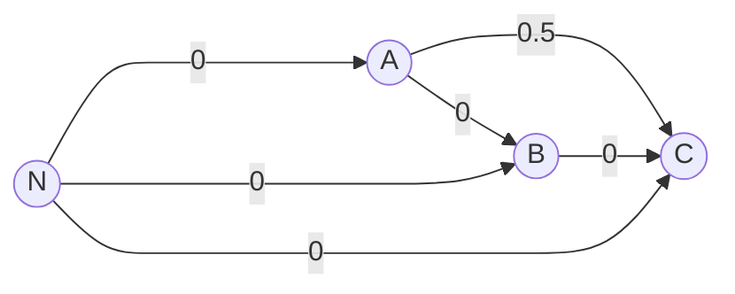

#### Runtime

- Create new node and add new edges: $\mathcal{O}(|V|)$
- Assign h-values: Bellman-Ford, $\mathcal{O}(|V|*|E|$
- $|V|$ times Dijkstra: $\mathcal{O}(|V|*|E| + |V|^2*log(|V|))$

### All Pair-Shortest Path

All the algorithms we know to solve the APSP problem can be compared in the following way (**top**: less general, **bottom**: more general):

| Graph                                                | Algorithm                                                | Runtime                                                      |
| ---------------------------------------------------- | -------------------------------------------------------- | ------------------------------------------------------------ |
| $G = (V, E)$                                         | $|V| * BFS$                                              | $\mathcal{O}(|V|*|E| + |V|^2)$                               |
| $G = (V, E, w)$<br />$w: E \rightarrow \mathbb{R}^+$ | $|V|* Dijkstra$                                          | $\mathcal{O}(|V| * |E| + |V|^2*log(|V|))$                    |
| $G = (V, E, w)$<br />$w: E \rightarrow \mathbb{R}$   | $|V|* Bellman-Ford$<br />$Floyd-Warshall$<br />$Johnson$ | $\mathcal{O}(|V|*|E|)$<br />$\mathcal{O}(|V|^3)$<br />$\mathcal{O}(|V|*|E| + |V|^2*log(|V|))$ |

